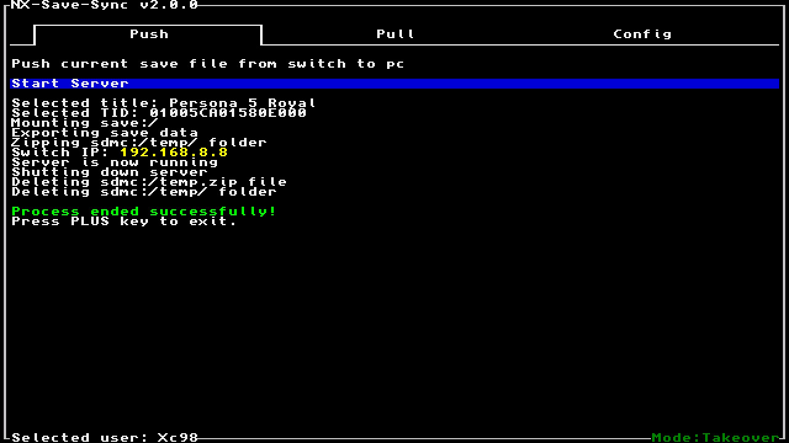
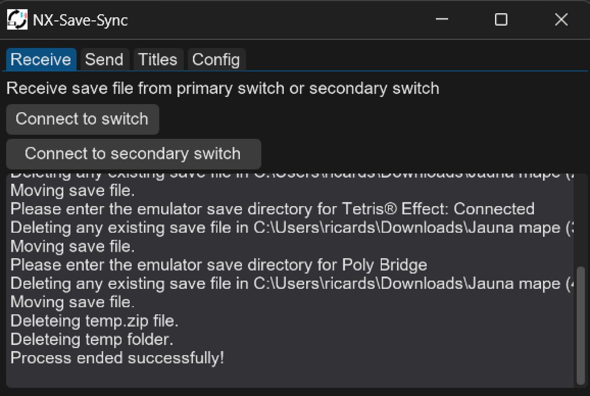
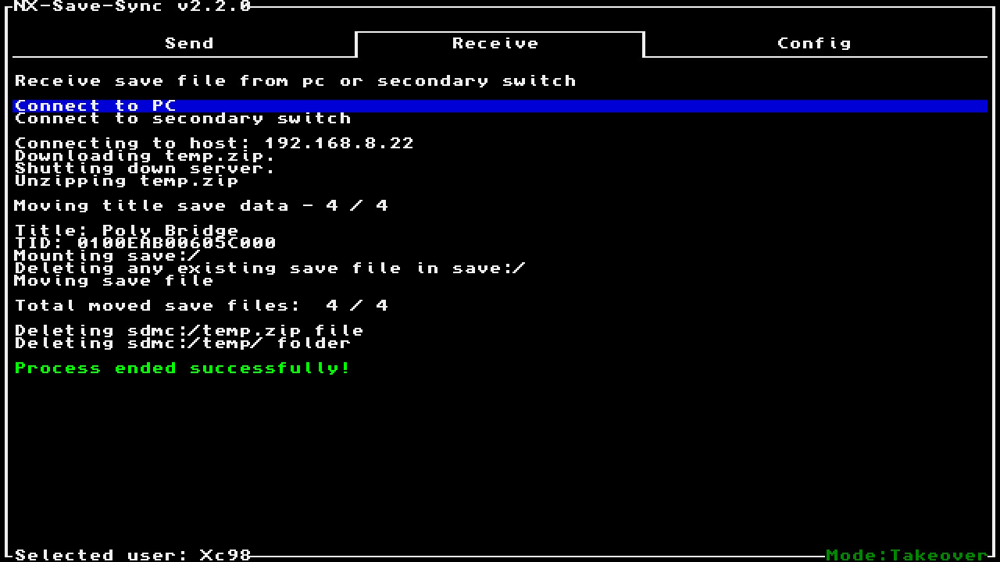
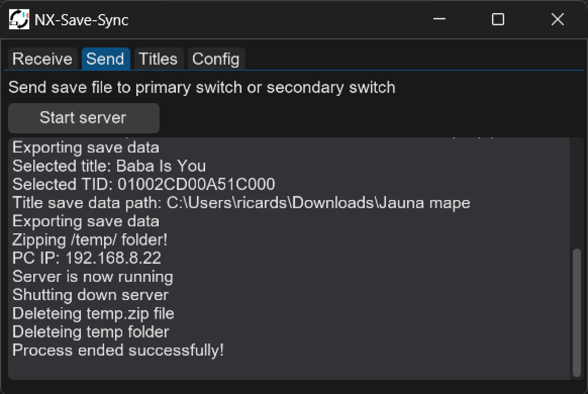

# NX Save sync

NX Save sync is a switch homebrew app to sync save files between switch and an emulator

## Usage

Check out the project [wiki](https://github.com/Xc987/NX-Save-Sync/wiki)

## Screenshots

<table width="100%">
  <thead>
    <tr>
      <th width="50%">Switch app</th>
      <th width="50%">Desktop app</th>
    </tr>
  </thead>
  <tbody>
    <tr>
      <td width="50%"></td>
      <td width="50%"></td>
    </tr>
    <tr>
      <td width="50%"></td>
      <td width="50%"></td>
    </tr>
  </tbody>
</table>

## Build

```
git clone https://github.com/Xc987/NX-Save-Sync
cd NX-Save-Sync
```

build switch app

```
make
```

build pc app

```
cd desktop
pip install -r requirements.txt
cxfreeze build
```