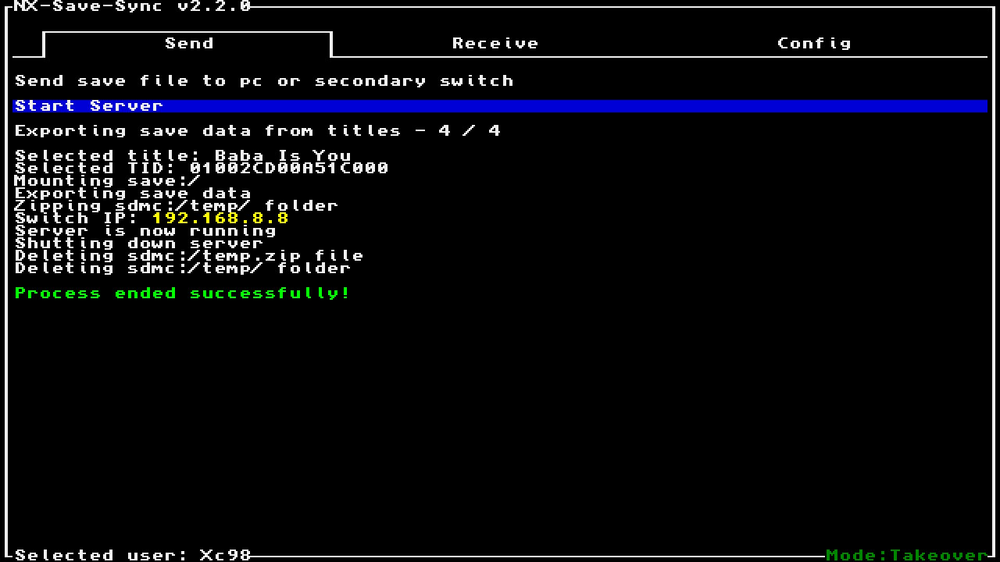

# NX Save Sync

NX Save Sync is a switch homebrew app to quickly sync save files between switch and an emulator.

## Usage

### Sync from switch to pc

- Run switch app and select "Start serever" in Push tab, use L / R to move between tabs.
- Press ZL / ZR to change the user and L / R to move between pages, select a title you want to sync.
- If no errors occured, you should see switch IP in yellow
- Open pc app, go to config tab and set the switch IP - **Only for the first time when syncing from switch to pc**
- In pc app, go to Pull tab and select "Connect to switch"
- Paste the emulator save file directory and press enter (**the directory contents will be deleted!**) - **Only for the first time syncing the selected title**
- If no errors occured, the save file should be copied from switch to pc

### Sync from pc to switch

- Open pc app, go to Push tab and select "Start server"
- Select the title you want to sync
- If no errors occured, you should see pc IP
- Run switch app, go to Config tab and select "Set PC IP" and enter the pc IP. - **Only for the first time when syncing from pc to switch**
- In switch app, go to Pull tab and select "Connect to PC"
- If no errors occured, the save file should be copied from pc to switch

Note: During sync between switch and pc, both devices must be on the same network. Currently exiting from the switch app while pushing a save file or waiting for pc to host server is not possible, might be added in later release.

## Screenshots

<table width="100%">
  <thead>
    <tr>
      <th width="50%">Switch app</th>
      <th width="50%">Desktop app</th>
    </tr>
  </thead>
  <tbody>
    <tr>
      <td width="50%"></td>
      <td width="50%"></td>
    </tr>
    <tr>
      <td width="50%"></td>
      <td width="50%"></td>
    </tr>
  </tbody>
</table>

## Build

```
git clone https://github.com/Xc987/NX-Save-Sync
cd NX-Save-Sync
```

build switch app

```
make
```

build pc app

```
cd desktop
pip install -r requirements.txt
cxfreeze build
```